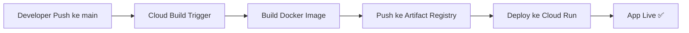

# 🚀 Panduan Deploy IdeaFrame ke Google Cloud Run + CI/CD

> Panduan lengkap dan self-contained untuk siapa saja yang ingin mendeploy projek ini ke Google Cloud Run dengan CI/CD otomatis via Cloud Build. **Kamu tidak perlu membuka file lain** — semua informasi yang dibutuhkan sudah ada di dokumen ini.

## Tentang Projek Ini

**IdeaFrame** (repo: `leeCode83/SpecFlow`) adalah aplikasi web full-stack untuk ideation dan spec generation berbasis AI. Tech stack:

| Layer | Teknologi |
|-------|-----------|
| Frontend | React 19 + Vite + TailwindCSS |
| Backend | Express.js (TypeScript) |
| AI | Google Gemini API (`@google/genai`) |
| Auth & DB | Supabase (Auth + PostgreSQL) |
| Runtime | Node.js 22 |

Aplikasi berjalan sebagai **single container** — Express meng-serve React build output (SPA) dan menyediakan API routes di `/api/*`.

## Environment Variables

Projek ini membutuhkan 5 environment variable wajib:

| Variable | Dibutuhkan Saat | Deskripsi |
|----------|----------------|-----------|
| `GEMINI_API_KEY` | Runtime | API key dari [Google AI Studio](https://aistudio.google.com/apikey) untuk Gemini AI |
| `APP_URL` | Build + Runtime | URL aplikasi (e.g. https://ideaframe-xxx.a.run.app) untuk redirect OAuth |
| `VITE_SUPABASE_URL` | Build + Runtime | URL project Supabase (format: `https://xxxxx.supabase.co`) |
| `VITE_SUPABASE_ANON_KEY` | Build + Runtime | Anon/public key Supabase |
| `VITE_SUPABASE_SERVICE_ROLE_KEY` | Runtime | Service role key Supabase (untuk server-side operations) |

> [!NOTE]
> Variable dengan prefix `VITE_` dibutuhkan **saat build** karena Vite meng-embed nilainya ke dalam JavaScript bundle frontend. Oleh karena itu, di `cloudbuild.yaml` mereka dipass sebagai `--build-arg` (build-time) DAN `--set-secrets` (runtime).

## Arsitektur Deployment



| Komponen | Teknologi |
|----------|-----------|
| **Runtime** | Google Cloud Run (serverless container) |
| **CI/CD** | Cloud Build (trigger otomatis saat push ke `main`) |
| **Container Registry** | Artifact Registry (`asia-southeast2`) |
| **Secrets** | Secret Manager |
| **Source** | GitHub (`leeCode83/SpecFlow`) |

---

## Prasyarat

Sebelum mulai, pastikan hal-hal berikut sudah terpenuhi:

- [ ] Punya akun Google Cloud — bisa daftar [free tier](https://cloud.google.com/free)
- [ ] Install [Google Cloud CLI (`gcloud`)](https://cloud.google.com/sdk/docs/install)
- [ ] Install [Docker Desktop](https://www.docker.com/products/docker-desktop/) (untuk test lokal)
- [ ] Install [Git](https://git-scm.com/)
- [ ] Repo projek sudah di-push ke GitHub
- [ ] Punya API Key Gemini dari [Google AI Studio](https://aistudio.google.com/apikey)
- [ ] Punya project Supabase dengan URL dan Anon Key

---

## Bagian 1: File-File yang Sudah Ada di Projek

Projek ini sudah menyertakan semua file yang dibutuhkan untuk deployment. Kamu **tidak perlu** membuat file baru.

### 1.1 `Dockerfile`

Multi-stage build — stage pertama untuk build, stage kedua hanya runtime (lebih kecil):

```dockerfile
# Build stage
FROM node:22-slim AS builder
WORKDIR /app
COPY package*.json ./
RUN npm install
COPY . .
ARG VITE_SUPABASE_URL
ARG VITE_SUPABASE_ANON_KEY
ARG APP_URL
ENV VITE_SUPABASE_URL=$VITE_SUPABASE_URL
ENV VITE_SUPABASE_ANON_KEY=$VITE_SUPABASE_ANON_KEY
ENV APP_URL=$APP_URL
RUN npm run build:all

# Runtime stage
FROM node:22-slim
WORKDIR /app
COPY package*.json ./
RUN npm install --omit=dev
COPY --from=builder /app/dist ./dist
COPY --from=builder /app/dist-server ./dist-server
ENV PORT=3000
EXPOSE 3000
ENV NODE_ENV=production
CMD ["npm", "start"]
```

> [!NOTE]
> `VITE_SUPABASE_URL` dan `VITE_SUPABASE_ANON_KEY` dipass sebagai `--build-arg` karena Vite membutuhkan variabel ini **saat build** (bukan runtime).

### 1.2 `cloudbuild.yaml`

Mendefinisikan 3 step CI/CD: build → push → deploy.

```yaml
steps:
  # 1. Build Docker image (inject secrets sebagai build-arg)
  - name: 'gcr.io/cloud-builders/docker'
    entrypoint: 'bash'
    args:
      - '-c'
      - |
        docker build \
          -t asia-southeast2-docker.pkg.dev/$PROJECT_ID/ideaframe-repo/ideaframe:$COMMIT_SHA \
          --build-arg VITE_SUPABASE_URL=$$SUPABASE_URL \
          --build-arg VITE_SUPABASE_ANON_KEY=$$SUPABASE_ANON_KEY \
          --build-arg APP_URL=$$APP_URL \
          .
    secretEnv: ['SUPABASE_URL', 'SUPABASE_ANON_KEY', 'APP_URL']

  # 2. Push image ke Artifact Registry
  - name: 'gcr.io/cloud-builders/docker'
    args: ['push', 'asia-southeast2-docker.pkg.dev/$PROJECT_ID/ideaframe-repo/ideaframe:$COMMIT_SHA']

  # 3. Deploy ke Cloud Run dengan secrets sebagai env vars
  - name: 'gcr.io/google.com/cloudsdktool/cloud-sdk'
    entrypoint: gcloud
    args:
      - 'run'
      - 'deploy'
      - 'ideaframe'
      - '--image'
      - 'asia-southeast2-docker.pkg.dev/$PROJECT_ID/ideaframe-repo/ideaframe:$COMMIT_SHA'
      - '--region'
      - 'asia-southeast2'
      - '--platform'
      - 'managed'
      - '--allow-unauthenticated'
      - '--set-secrets=GEMINI_API_KEY=GEMINI_API_KEY:latest,VITE_SUPABASE_URL=VITE_SUPABASE_URL:latest,VITE_SUPABASE_ANON_KEY=VITE_SUPABASE_ANON_KEY:latest,VITE_SUPABASE_SERVICE_ROLE_KEY=VITE_SUPABASE_SERVICE_ROLE_KEY:latest,APP_URL=APP_URL:latest'

availableSecrets:
  secretManager:
  - versionName: projects/$PROJECT_ID/secrets/VITE_SUPABASE_URL/versions/latest
    env: 'SUPABASE_URL'
  - versionName: projects/$PROJECT_ID/secrets/VITE_SUPABASE_ANON_KEY/versions/latest
    env: 'SUPABASE_ANON_KEY'
  - versionName: projects/$PROJECT_ID/secrets/APP_URL/versions/latest
    env: 'APP_URL'

images:
  - 'asia-southeast2-docker.pkg.dev/$PROJECT_ID/ideaframe-repo/ideaframe:$COMMIT_SHA'

options:
  logging: CLOUD_LOGGING_ONLY
```

### 1.3 `.dockerignore`

```
node_modules
dist
dist-server
.env
.env.local
.git
.vscode
```

### 1.4 Script di `package.json`

```json
{
  "scripts": {
    "dev": "tsx server.ts",
    "start": "node dist-server/server.js",
    "build": "vite build",
    "build:server": "tsup server.ts --format esm --target node20 --out-dir dist-server --clean",
    "build:all": "npm run build && npm run build:server"
  }
}
```

---

## Bagian 2: Setup Google Cloud Platform (Step-by-Step)

### Step 1 — Login & Buat Project

```bash
# Login ke Google Cloud
gcloud auth login

# Buat project baru (ganti PROJECT_ID sesuai keinginan)
gcloud projects create PROJECT_ID --name="IdeaFrame"

# Set sebagai project aktif
gcloud config set project PROJECT_ID
```

> [!IMPORTANT]
> `PROJECT_ID` harus unik secara global. Contoh: `ideaframe-leandro-2026`.
> Jika project sudah ada, langsung `gcloud config set project PROJECT_ID`.

**Aktifkan billing** (wajib untuk Cloud Run):
→ Buka https://console.cloud.google.com/billing dan link billing account ke project.

### Step 2 — Aktifkan API yang Dibutuhkan

```bash
gcloud services enable \
  run.googleapis.com \
  cloudbuild.googleapis.com \
  artifactregistry.googleapis.com \
  secretmanager.googleapis.com
```

| API | Fungsi |
|-----|--------|
| `run.googleapis.com` | Menjalankan container (Cloud Run) |
| `cloudbuild.googleapis.com` | CI/CD pipeline |
| `artifactregistry.googleapis.com` | Menyimpan Docker image |
| `secretmanager.googleapis.com` | Menyimpan API keys & secrets |

### Step 3 — Buat Artifact Registry Repository

```bash
gcloud artifacts repositories create ideaframe-repo \
  --repository-format=docker \
  --location=asia-southeast2 \
  --description="Docker images untuk IdeaFrame"
```

> [!TIP]
> Region `asia-southeast2` = Jakarta. Pilihan terbaik untuk latency rendah dari Indonesia.

### Step 4 — Simpan Secrets ke Secret Manager

```bash
# Gemini API Key
echo -n "ISI_GEMINI_API_KEY_MU" | \
  gcloud secrets create GEMINI_API_KEY --data-file=-

# App URL (untuk redirect OAuth)
echo -n "https://ideaframe-xxx.a.run.app" | \
  gcloud secrets create APP_URL --data-file=-

# Supabase URL
echo -n "https://xxxxx.supabase.co" | \
  gcloud secrets create VITE_SUPABASE_URL --data-file=-

# Supabase Anon Key
echo -n "eyJhbGciOiJI..." | \
  gcloud secrets create VITE_SUPABASE_ANON_KEY --data-file=-

# Supabase Service Role Key
echo -n "eyJhbGciOiJI..." | \
  gcloud secrets create VITE_SUPABASE_SERVICE_ROLE_KEY --data-file=-
```

**Untuk update secret yang sudah ada:**

```bash
echo -n "NILAI_BARU" | \
  gcloud secrets versions add NAMA_SECRET --data-file=-
```

**Verifikasi semua secrets:**

```bash
gcloud secrets list
```

### Step 5 — Konfigurasi IAM Permissions

Cloud Build butuh permission untuk deploy dan akses secrets:

```bash
# Dapatkan project number
PROJECT_ID=$(gcloud config get-value project)
PROJECT_NUMBER=$(gcloud projects describe $PROJECT_ID --format='value(projectNumber)')

# 1. Izinkan Cloud Build deploy ke Cloud Run
gcloud projects add-iam-policy-binding $PROJECT_ID \
  --member="serviceAccount:${PROJECT_NUMBER}@cloudbuild.gserviceaccount.com" \
  --role="roles/run.admin"

# 2. Izinkan Cloud Build bertindak sebagai service account
gcloud projects add-iam-policy-binding $PROJECT_ID \
  --member="serviceAccount:${PROJECT_NUMBER}@cloudbuild.gserviceaccount.com" \
  --role="roles/iam.serviceAccountUser"

# 3. Izinkan Cloud Build mengakses secrets
gcloud projects add-iam-policy-binding $PROJECT_ID \
  --member="serviceAccount:${PROJECT_NUMBER}@cloudbuild.gserviceaccount.com" \
  --role="roles/secretmanager.secretAccessor"
```

> [!WARNING]
> Jika kamu skip step ini, build akan gagal dengan error `PERMISSION_DENIED`. Ini penyebab error deploy **paling umum**.

### Step 6 — Hubungkan GitHub Repository ke Cloud Build

Ada **2 cara**: via Console (GUI) atau via `gcloud` CLI.

#### Cara A: Via Google Cloud Console (Recommended untuk Pertama Kali)

1. Buka https://console.cloud.google.com/cloud-build/triggers
2. Klik **"Connect Repository"**
3. Pilih **"GitHub (Cloud Build GitHub App)"**
4. Klik **"Authenticate"** → login GitHub → authorize Google Cloud Build
5. Pilih repository `leeCode83/SpecFlow` → klik **"Connect"**
6. Setelah connected, lanjut ke **Step 7** untuk membuat trigger

#### Cara B: Via `gcloud` CLI

```bash
# 1. Buat koneksi ke GitHub
gcloud builds connections create github \
  --name="github-connection" \
  --region=asia-southeast2

# 2. Buka URL yang muncul di terminal untuk authorize di browser
#    → Login GitHub → Authorize → Install app ke repo yang diinginkan

# 3. Setelah authorized, link repository spesifik
gcloud builds repositories create ideaframe-repo-link \
  --connection=github-connection \
  --remote-uri=https://github.com/leeCode83/SpecFlow.git \
  --region=asia-southeast2
```

> [!NOTE]
> Cara CLI memerlukan langkah authorize di browser juga. Untuk first-time setup, Console (Cara A) biasanya lebih straightforward.

### Step 7 — Buat Cloud Build Trigger

Trigger ini yang membuat **auto-deploy setiap push ke branch `main`**.

#### Via Console (GUI)

1. Buka https://console.cloud.google.com/cloud-build/triggers
2. Klik **"Create Trigger"**
3. Isi form:

| Setting | Value |
|---------|-------|
| **Name** | `deploy-on-push-main` |
| **Region** | `global` |
| **Event** | Push to a branch |
| **Source** | Pilih repo `leeCode83/SpecFlow` yang sudah connected |
| **Branch** | `^main$` |
| **Type** | Cloud Build configuration file (yaml or json) |
| **Location** | Repository → `/cloudbuild.yaml` |

4. Klik **"Create"**

#### Via `gcloud` CLI (1st Gen Trigger)

```bash
gcloud builds triggers create github \
  --name="deploy-on-push-main" \
  --repo-name="SpecFlow" \
  --repo-owner="leeCode83" \
  --branch-pattern="^main$" \
  --build-config="cloudbuild.yaml"
```

#### Via `gcloud` CLI (2nd Gen Trigger — jika pakai Connection dari Step 6B)

```bash
gcloud builds triggers create github \
  --name="deploy-on-push-main" \
  --region=asia-southeast2 \
  --repository="projects/PROJECT_ID/locations/asia-southeast2/connections/github-connection/repositories/ideaframe-repo-link" \
  --branch-pattern="^main$" \
  --build-config="cloudbuild.yaml"
```

> [!IMPORTANT]
> Setelah trigger dibuat, setiap `git push` ke branch `main` akan otomatis memicu build & deploy.

### Step 8 — Test Deployment

```bash
# Push sesuatu ke main untuk trigger build
git add .
git commit -m "chore: trigger initial deployment"
git push origin main
```

**Monitor build:**

```bash
# Lihat build yang sedang berjalan
gcloud builds list --limit=5

# Lihat log build tertentu
gcloud builds log BUILD_ID

# Stream log build yang sedang berjalan
gcloud builds log BUILD_ID --stream
```

**Atau via Console:**
→ https://console.cloud.google.com/cloud-build/builds

**Setelah build sukses, cek URL Cloud Run:**

```bash
gcloud run services describe ideaframe \
  --region=asia-southeast2 \
  --format='value(status.url)'
```

**Validasi app berjalan:**

```bash
# Health check
curl https://YOUR_CLOUD_RUN_URL/api/health
# Expected: {"status":"ok","timestamp":"..."}
```

---

## Bagian 3: Test Lokal dengan Docker

Sebelum push ke Cloud, pastikan Docker image bisa jalan di lokal:

```bash
# Build image
docker build \
  -t ideaframe \
  --build-arg VITE_SUPABASE_URL="https://xxx.supabase.co" \
  --build-arg VITE_SUPABASE_ANON_KEY="eyJ..." \
  .

# Jalankan container
docker run -p 3000:3000 \
  -e GEMINI_API_KEY="your-key" \
  -e VITE_SUPABASE_URL="https://xxx.supabase.co" \
  -e VITE_SUPABASE_ANON_KEY="eyJ..." \
  ideaframe

# Buka di browser → http://localhost:3000
# Test health endpoint → http://localhost:3000/api/health
```

---

## Bagian 4: Checklist Deployment (Urut)

### Sisi Projek ✅
- [ ] Pastikan `Dockerfile` ada di root
- [ ] Pastikan `.dockerignore` ada di root
- [ ] Pastikan `cloudbuild.yaml` ada di root
- [ ] Pastikan `package.json` punya script `build:all` dan `start`
- [ ] Test lokal dengan Docker (opsional tapi recommended)

### Sisi Google Cloud
- [ ] Login `gcloud auth login`
- [ ] Buat / pilih GCP project
- [ ] Aktifkan billing
- [ ] Aktifkan 4 API (Run, Build, Artifact Registry, Secret Manager)
- [ ] Buat Artifact Registry repository `ideaframe-repo`
- [ ] Simpan 3 secrets (GEMINI_API_KEY, VITE_SUPABASE_URL, VITE_SUPABASE_ANON_KEY)
- [ ] Set 3 IAM permissions untuk Cloud Build service account
- [ ] Connect GitHub repo ke Cloud Build
- [ ] Buat trigger `deploy-on-push-main` untuk branch `main`

### Validasi
- [ ] Push ke `main` → cek Cloud Build history → build sukses ✅
- [ ] Buka URL Cloud Run → app tampil ✅
- [ ] Hit `/api/health` → return `{ status: "ok" }` ✅

---

## Estimasi Biaya

| Layanan | Free Tier | Estimasi di Luar Free Tier |
|---------|-----------|----------------------------|
| Cloud Run | 2 juta request/bulan, 360K vCPU-sec | ~$0 untuk low traffic |
| Cloud Build | 120 build-minutes/hari | ~$0 untuk kebanyakan kasus |
| Artifact Registry | 500 MB storage | ~$0.10/GB/bulan |
| Secret Manager | 10K akses/bulan | ~$0 |

> [!TIP]
> Untuk projek kuliah/hackathon, hampir pasti semua masuk free tier. Total biaya: **$0** atau sangat minimal.

---

## Troubleshooting

### ❌ Build gagal: `PERMISSION_DENIED`

**Penyebab:** Cloud Build service account belum punya permission yang cukup.

```bash
# Jalankan ulang 3 perintah IAM di Step 5
PROJECT_ID=$(gcloud config get-value project)
PROJECT_NUMBER=$(gcloud projects describe $PROJECT_ID --format='value(projectNumber)')

gcloud projects add-iam-policy-binding $PROJECT_ID \
  --member="serviceAccount:${PROJECT_NUMBER}@cloudbuild.gserviceaccount.com" \
  --role="roles/run.admin"

gcloud projects add-iam-policy-binding $PROJECT_ID \
  --member="serviceAccount:${PROJECT_NUMBER}@cloudbuild.gserviceaccount.com" \
  --role="roles/iam.serviceAccountUser"

gcloud projects add-iam-policy-binding $PROJECT_ID \
  --member="serviceAccount:${PROJECT_NUMBER}@cloudbuild.gserviceaccount.com" \
  --role="roles/secretmanager.secretAccessor"
```

### ❌ Build gagal: `Secret not found`

**Penyebab:** Secret belum dibuat atau nama tidak cocok.

```bash
# Cek daftar secrets yang ada
gcloud secrets list

# Pastikan nama cocok persis: GEMINI_API_KEY, VITE_SUPABASE_URL, VITE_SUPABASE_ANON_KEY
```

### ❌ Build gagal: `denied: Permission "artifactregistry.repositories.uploadArtifacts" denied`

**Penyebab:** Artifact Registry repository belum dibuat atau nama/region salah.

```bash
# Cek apakah repo sudah ada
gcloud artifacts repositories list --location=asia-southeast2

# Jika belum ada, buat:
gcloud artifacts repositories create ideaframe-repo \
  --repository-format=docker \
  --location=asia-southeast2
```

### ❌ Cloud Run deploy sukses tapi app crash / error 503

**Penyebab:** Biasanya runtime secret tidak ter-inject atau port tidak match.

```bash
# Cek logs Cloud Run
gcloud run services logs read ideaframe --region=asia-southeast2 --limit=50

# Cek environment variables yang ter-set
gcloud run services describe ideaframe \
  --region=asia-southeast2 \
  --format='yaml(spec.template.spec.containers[0].env)'
```

### ❌ Trigger tidak jalan saat push ke `main`

**Penyebab:**
1. Repo belum ter-connect ke Cloud Build
2. Branch pattern salah
3. Trigger disabled

```bash
# Cek daftar trigger
gcloud builds triggers list

# Cek status trigger
gcloud builds triggers describe deploy-on-push-main

# Jalankan trigger secara manual
gcloud builds triggers run deploy-on-push-main --branch=main
```

### ❌ `npm run build:all` gagal di Docker

**Penyebab:** Dependency `tsup` tidak terinstall.

```bash
# Pastikan tsup ada di devDependencies
npm ls tsup

# Jika tidak ada:
npm install -D tsup
```

### ❌ Error `gcloud builds connections create`: API not enabled

```bash
# Aktifkan API yang dibutuhkan
gcloud services enable cloudbuild.googleapis.com
gcloud services enable secretmanager.googleapis.com
```

---

## FAQ

### Q: Apakah saya harus bayar untuk pakai ini?

**A:** Tidak untuk skala kecil. Google Cloud punya free tier yang generous — 2 juta request/bulan di Cloud Run dan 120 menit build/hari. Projek kuliah/hackathon hampir selalu gratis.

### Q: Bagaimana cara update secret (misal ganti API key)?

**A:**
```bash
echo -n "NILAI_BARU" | gcloud secrets versions add NAMA_SECRET --data-file=-

# Setelah update, redeploy agar Cloud Run ambil versi terbaru:
gcloud builds triggers run deploy-on-push-main --branch=main
```

### Q: Kenapa Supabase keys dipass sebagai `--build-arg` DAN `--set-secrets`?

**A:** Karena Vite membutuhkan `VITE_*` env vars **saat compile-time** (build) untuk di-embed ke JavaScript bundle frontend. Sedangkan `--set-secrets` di Cloud Run untuk runtime server-side.

### Q: Bagaimana cara rollback ke versi sebelumnya?

**A:**
```bash
# Lihat revisi yang tersedia
gcloud run revisions list --service=ideaframe --region=asia-southeast2

# Rollback ke revisi tertentu
gcloud run services update-traffic ideaframe \
  --to-revisions=NAMA_REVISI=100 \
  --region=asia-southeast2
```

### Q: Bagaimana menambah environment variable baru?

**A:**
1. Buat secret baru:
   ```bash
   echo -n "nilai" | gcloud secrets create NAMA_SECRET --data-file=-
   ```
2. Tambahkan ke `--set-secrets` di `cloudbuild.yaml`:
   ```yaml
   - '--set-secrets=...,NAMA_SECRET=NAMA_SECRET:latest'
   ```
3. Jika dibutuhkan saat build (prefix `VITE_`), tambahkan juga di `availableSecrets` dan `--build-arg`.

### Q: Apakah bisa deploy ke region selain Jakarta?

**A:** Bisa. Ganti semua referensi `asia-southeast2` ke region yang diinginkan. Daftar region: https://cloud.google.com/run/docs/locations

### Q: Bagaimana cara melihat URL app setelah deploy?

**A:**
```bash
gcloud run services describe ideaframe \
  --region=asia-southeast2 \
  --format='value(status.url)'
```

### Q: Bagaimana kalau saya ingin deploy dari branch lain (bukan `main`)?

**A:** Buat trigger tambahan dengan `--branch-pattern` berbeda:
```bash
gcloud builds triggers create github \
  --name="deploy-on-push-dev" \
  --repo-name="SpecFlow" \
  --repo-owner="leeCode83" \
  --branch-pattern="^dev$" \
  --build-config="cloudbuild.yaml"
```

### Q: Apakah Cloud Run bisa custom domain?

**A:**
```bash
# Map custom domain
gcloud run domain-mappings create \
  --service=ideaframe \
  --domain=app.example.com \
  --region=asia-southeast2

# Ikuti instruksi DNS yang ditampilkan
```

### Q: Bagaimana cara switch antara beberapa Google Cloud account?

**A:**
```bash
# Lihat akun yang aktif
gcloud auth list

# Switch akun
gcloud config set account EMAIL_AKUN

# Atau buat konfigurasi terpisah
gcloud config configurations create nama-config
gcloud config set account EMAIL
gcloud config set project PROJECT_ID
```

---

## Quick Reference Commands

```bash
# === Status ===
gcloud config get-value project         # Project aktif
gcloud run services list                # Semua service Cloud Run
gcloud builds list --limit=5            # Build terakhir
gcloud secrets list                     # Semua secrets
gcloud builds triggers list             # Semua triggers

# === Logs ===
gcloud run services logs read ideaframe --region=asia-southeast2 --limit=20
gcloud builds log BUILD_ID --stream

# === Manual Trigger ===
gcloud builds triggers run deploy-on-push-main --branch=main

# === Cleanup (hati-hati!) ===
gcloud run services delete ideaframe --region=asia-southeast2
gcloud artifacts repositories delete ideaframe-repo --location=asia-southeast2
gcloud builds triggers delete deploy-on-push-main
```
