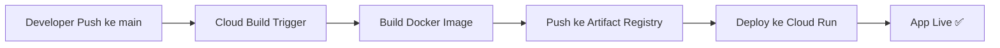

# 🚀 Brief: Deploy SpecFlow ke Google Cloud Run + CI/CD

## Arsitektur Deployment



**Target Platform:** Google Cloud Run (serverless container)
**CI/CD:** Cloud Build (trigger otomatis saat push ke `main`)

---

## Bagian 1: Yang Perlu Ditambahkan/Diubah di Projek

### 1.1 Dockerfile
> File baru di root projek.

Fungsinya untuk mengemas aplikasi menjadi Docker container yang bisa dijalankan di Cloud Run.

Poin penting:
- Multi-stage build: tahap pertama untuk `npm install` + `vite build`, tahap kedua untuk runtime (lebih ringan)
- Menjalankan `server.ts` (yang sudah di-compile) sebagai entry point
- Expose port `3000` (sesuai `server.ts`)

### 1.2 `.dockerignore`
> File baru di root projek.

Agar Docker tidak meng-copy file yang tidak perlu (seperti `node_modules`, `.env`, `dist/`) ke dalam image.

### 1.3 Update `package.json` Scripts
> Modifikasi file yang ada.

Perlu ditambahkan script `build:server` untuk compile `server.ts` ke JavaScript (karena Cloud Run menjalankan Node.js, bukan `tsx`).

```diff
"scripts": {
   "dev": "tsx server.ts",
-  "start": "node server.js",
+  "start": "node dist-server/server.js",
+  "build:server": "tsc server.ts --outDir dist-server --esModuleInterop --module esnext --moduleResolution bundler --skipLibCheck",
+  "build:all": "npm run build && npm run build:server",
   "build": "vite build",
}
```

> [!NOTE]
> Alternatif: gunakan `tsup` atau `esbuild` untuk build server agar lebih cepat dan tidak perlu konfigurasi tsconfig terpisah.

### 1.4 `cloudbuild.yaml`
> File baru di root projek.

File ini mendefinisikan langkah-langkah CI/CD yang akan dijalankan Cloud Build:
1. Build Docker image
2. Push image ke Artifact Registry
3. Deploy image ke Cloud Run dengan environment variables dari Secret Manager

### 1.5 Update `.gitignore`
> Tambahkan entry untuk build output server.

```diff
+ # Server build output
+ dist-server/
```

---

## Bagian 2: Setup di Google Cloud Platform

### 2.1 Prasyarat
- [ ] Punya akun Google Cloud (bisa pakai [free tier](https://cloud.google.com/free))
- [ ] Install [Google Cloud CLI (`gcloud`)](https://cloud.google.com/sdk/docs/install) di laptop
- [ ] Login: `gcloud auth login`
- [ ] Repo projek sudah di-push ke GitHub

### 2.2 Buat Google Cloud Project

```bash
# Buat project baru (atau pakai yang sudah ada)
gcloud projects create specflow-app --name="SpecFlow App"

# Set sebagai project aktif
gcloud config set project specflow-app

# Aktifkan billing (wajib untuk Cloud Run)
# → Lakukan via console: https://console.cloud.google.com/billing
```

### 2.3 Aktifkan API yang Dibutuhkan

```bash
gcloud services enable \
  run.googleapis.com \
  cloudbuild.googleapis.com \
  artifactregistry.googleapis.com \
  secretmanager.googleapis.com
```

| API | Fungsi |
|-----|--------|
| Cloud Run | Menjalankan container |
| Cloud Build | CI/CD pipeline |
| Artifact Registry | Menyimpan Docker image |
| Secret Manager | Menyimpan API keys & secrets |

### 2.4 Buat Artifact Registry Repository

```bash
gcloud artifacts repositories create specflow-repo \
  --repository-format=docker \
  --location=asia-southeast2 \
  --description="Docker images untuk SpecFlow"
```

> [!TIP]
> Gunakan `asia-southeast2` (Jakarta) untuk latency paling rendah dari Indonesia.

### 2.5 Simpan Secrets ke Secret Manager

Setiap environment variable sensitif harus disimpan sebagai secret, **bukan** di-hardcode di mana pun:

```bash
# Gemini API Key
echo -n "YOUR_ACTUAL_GEMINI_KEY" | \
  gcloud secrets create GEMINI_API_KEY --data-file=-

# Supabase URL
echo -n "YOUR_SUPABASE_URL" | \
  gcloud secrets create VITE_SUPABASE_URL --data-file=-

# Supabase Anon Key
echo -n "YOUR_SUPABASE_ANON_KEY" | \
  gcloud secrets create VITE_SUPABASE_ANON_KEY --data-file=-
```

### 2.6 Konfigurasi IAM Permissions

Cloud Build butuh permission untuk deploy ke Cloud Run dan akses secrets:

```bash
PROJECT_NUMBER=$(gcloud projects describe specflow-app --format='value(projectNumber)')

# Izinkan Cloud Build men-deploy ke Cloud Run
gcloud projects add-iam-policy-binding specflow-app \
  --member="serviceAccount:${PROJECT_NUMBER}@cloudbuild.gserviceaccount.com" \
  --role="roles/run.admin"

# Izinkan Cloud Build bertindak sebagai service account
gcloud projects add-iam-policy-binding specflow-app \
  --member="serviceAccount:${PROJECT_NUMBER}@cloudbuild.gserviceaccount.com" \
  --role="roles/iam.serviceAccountUser"

# Izinkan Cloud Build mengakses secrets
gcloud projects add-iam-policy-binding specflow-app \
  --member="serviceAccount:${PROJECT_NUMBER}@cloudbuild.gserviceaccount.com" \
  --role="roles/secretmanager.secretAccessor"
```

### 2.7 Hubungkan GitHub ke Cloud Build

1. Buka [Cloud Build Triggers](https://console.cloud.google.com/cloud-build/triggers) di Console
2. Klik **"Connect Repository"**
3. Pilih **GitHub** → Autentikasi → Pilih repo SpecFlow
4. Buat Trigger:

| Setting | Value |
|---------|-------|
| Name | `deploy-on-push-main` |
| Event | Push to a branch |
| Branch | `^main$` |
| Configuration | Cloud Build config file |
| Config file location | `/cloudbuild.yaml` |

> [!IMPORTANT]
> Setelah trigger dibuat, setiap `git push` ke branch `main` akan otomatis memicu build & deploy.

---

## Bagian 3: Checklist Eksekusi (Urut)

### Sisi Projek
- [ ] Buat `Dockerfile` (multi-stage build)
- [ ] Buat `.dockerignore`
- [ ] Update `package.json` scripts (tambah `build:server`, `build:all`, update `start`)
- [ ] Buat `cloudbuild.yaml`
- [ ] Update `.gitignore` (tambah `dist-server/`)
- [ ] Test lokal: `docker build -t specflow .` → `docker run -p 3000:3000 specflow`

### Sisi Google Cloud
- [ ] Buat/pilih GCP Project
- [ ] Aktifkan billing
- [ ] Aktifkan 4 API (Run, Build, Artifact Registry, Secret Manager)
- [ ] Buat Artifact Registry repository
- [ ] Simpan semua secrets ke Secret Manager
- [ ] Set IAM permissions untuk Cloud Build service account
- [ ] Connect GitHub repo ke Cloud Build
- [ ] Buat Cloud Build Trigger untuk branch `main`

### Validasi
- [ ] Push ke `main` → cek Cloud Build history apakah build sukses
- [ ] Buka URL Cloud Run → pastikan app berjalan
- [ ] Test endpoint `/api/health` → harus return `{ status: "ok" }`

---

## Estimasi Biaya

| Layanan | Free Tier | Estimasi Biaya di Luar Free Tier |
|---------|-----------|----------------------------------|
| Cloud Run | 2 juta request/bulan, 360K vCPU-seconds | ~$0 untuk low traffic |
| Cloud Build | 120 build-minutes/hari | ~$0 untuk kebanyakan kasus |
| Artifact Registry | 500 MB storage | ~$0.10/GB/bulan |
| Secret Manager | 10K akses/bulan | ~$0 |

> [!TIP]
> Untuk projek kuliah/hackathon, kemungkinan besar semua masuk free tier. Total biaya: **$0** atau sangat minimal.

---

## Langkah Selanjutnya

Setelah brief ini disetujui, saya bisa langsung:
1. Membuat `Dockerfile`
2. Membuat `.dockerignore`
3. Membuat `cloudbuild.yaml`
4. Mengupdate `package.json`

Konfirmasi apakah brief ini sudah sesuai, atau ada hal yang ingin diubah/ditambahkan? 🎯
