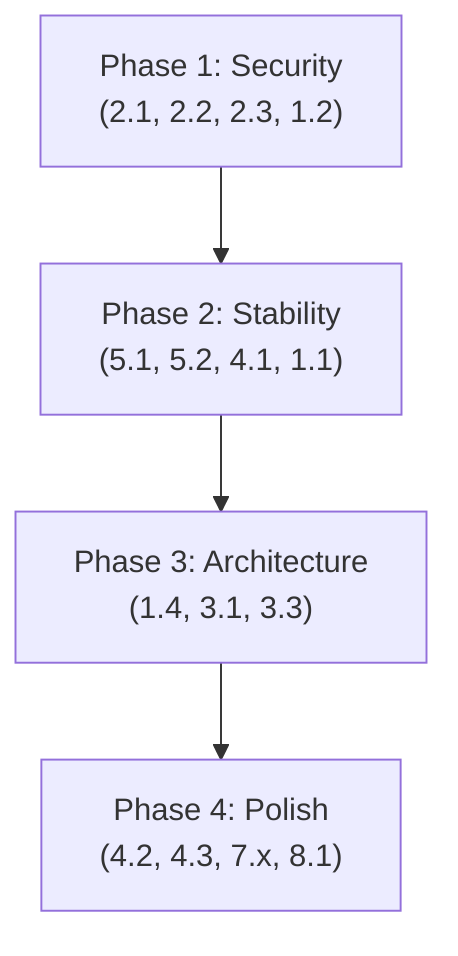

# IdeaFrame — Codebase Audit & Optimization Brief

> **Tanggal:** 10 Mei 2026
> **Auditor:** AI Code Reviewer
> **Scope:** Full-stack audit (`server/`, `src/`, migrations, config, CI/CD)
> **Untuk:** Programmer yang akan melakukan refactor & optimasi

---

## Ringkasan Eksekutif

IdeaFrame adalah platform spec-driven development yang menggunakan **React 19 + Vite** (frontend), **Express + tsx** (backend), **Supabase** (DB/Auth/Storage), dan **Gemini API** (AI). Secara umum arsitektur sudah baik dengan pemisahan server MVC yang benar (routes → controllers → services), dan data layer yang rapi. Namun ada **beberapa isu arsitektural, keamanan, performa, dan kualitas kode** yang perlu diperbaiki sebelum production-ready.

> [!IMPORTANT]
> Prioritas dinilai berdasarkan: 🔴 **Kritis** (harus segera), 🟠 **Tinggi** (sebelum production), 🟡 **Sedang** (saat refactor), 🟢 **Rendah** (nice-to-have)

---

## 1. Arsitektur & Separation of Concerns

### 🟠 1.1 — Rogue Route di `server.ts`

**Masalah:** Endpoint `/api/embed-spec` (line 26-43) didefinisikan langsung di `server.ts`, melewati pola MVC yang sudah ada di `server/routes/` dan `server/controllers/`.

**Dampak:** Inkonsistensi arsitektur. Saat route bertambah, `server.ts` membengkak.

**Aksi:**
- Pindahkan logic embed ke `geminiController.ts` (method `embedSpec`)
- Tambahkan route di `geminiRoutes.ts`: `geminiRoutes.post("/embed-spec", ...)`
- `server.ts` hanya berisi: middleware setup, route mounting, Vite middleware, `app.listen()`

---

### 🟠 1.2 — `server.ts` Import Frontend Module (`supabase-specs`)

**Masalah:** `server.ts` line 7 mengimpor `./src/lib/supabase/supabase-specs` — ini adalah modul **frontend** yang menggunakan Supabase **client-side** (anon key).

**Dampak:**
- **Keamanan:** Server menggunakan `anon key` untuk operasi DB, bukan `service_role` key. Artinya server terikat RLS policy yang sama dengan client — ini **meniadakan keuntungan** dari server-side processing.
- **Build coupling:** Backend code mengimpor frontend code → tsup build bisa bermasalah jika ada browser-only API.

**Aksi:**
- Buat **server-side Supabase client** terpisah di `server/lib/supabase.ts` menggunakan `VITE_SUPABASE_SERVICE_ROLE_KEY`
- Pisahkan route `/api/embed-spec` ke `server/routes/geminiRoutes.ts` dan hapus dari `server.ts`
- Tambahkan `VITE_SUPABASE_SERVICE_ROLE_KEY` ke `.env.example` dan Secret Manager

---

### 🟡 1.3 — Duplicated Gemini Client

**Masalah:** Ada **dua layer** Gemini integration:
1. `server/services/geminiService.ts` — actual Gemini SDK calls (server-side)
2. `src/lib/gemini/*.ts` — thin fetch wrappers ke `/api/gemini/*` (client-side)

Ini sebenarnya **benar secara pattern** (client → API → service), tapi:
- `src/lib/gemini/gemini.ts` re-exports semua, termasuk `gemini-simplify.ts` yang **tidak** di-export (missing export)
- `test-gemini.ts` di root mengimpor dari `src/lib/gemini/gemini-ideation` — ini client-side module yang **tidak bisa jalan langsung** di Node tanpa server running

**Aksi:**
- Hapus `test-gemini.ts` dari root (dead code, tidak bisa dijalankan standalone)
- Pastikan barrel export di `gemini.ts` lengkap (tambah `gemini-simplify`)

---

### 🟡 1.4 — Mega-Components (Workspace & SpecDetail)

**Masalah:**
- `Workspace.tsx`: **1009 lines**, 20+ state variables, handles: specs CRUD, file upload, team management, GitHub URL, activity logs, search/filter UI
- `SpecDetail.tsx`: **523 lines**, handles: spec editing, AI chat, RAG retrieval, save+embed, title editing, copy prompt

**Dampak:** Sulit di-maintain, di-test, dan di-review. Setiap perubahan kecil memerlukan pemahaman 1000+ baris.

**Aksi (Workspace):**
| Concern | Extract ke |
|---------|-----------|
| Spec CRUD + state | `hooks/useProjectSpecs.ts` |
| File upload logic | `hooks/useProjectFiles.ts` |
| Team management | `hooks/useTeamManagement.ts` |
| Activity logs + pagination | `hooks/useActivityLogs.ts` |
| GitHub URL editing | `components/workspace/GitHubSection.tsx` |
| Spec grid/list | `components/workspace/SpecGrid.tsx` |
| File gallery | `components/workspace/FileGallery.tsx` |
| Activity feed | `components/workspace/ActivityFeed.tsx` |

**Aksi (SpecDetail):**
| Concern | Extract ke |
|---------|-----------|
| Chat + AI logic | `hooks/useSpecChat.ts` |
| Save + embed logic | `hooks/useSpecPersistence.ts` |
| RAG retrieval | `hooks/useRAGContext.ts` |
| Chat panel UI | `components/spec/ChatPanel.tsx` |
| Editor panel UI | `components/spec/EditorPanel.tsx` |

---

## 2. Keamanan

### 🔴 2.1 — Tidak Ada Input Validation di API Routes

**Masalah:** Semua endpoint di `geminiController.ts` langsung destructure `req.body` tanpa validasi:
```typescript
// Tidak ada validasi tipe, panjang, atau format
const { idea, mode } = req.body;
```

**Dampak:** Rawan injection, data korup, atau crash jika body malformed.

**Aksi:**
- Tambahkan Zod schemas untuk setiap endpoint:
```typescript
const AnalyzeIdeaSchema = z.object({
  idea: z.string().min(1).max(5000),
  mode: z.enum(['Learning', 'Hackathon', 'Startup']),
});
```
- Buat middleware `validateBody(schema)` di `server/middleware/validate.ts`
- Apply ke semua routes

---

### 🟠 2.2 — Tidak Ada Rate Limiting

**Masalah:** API endpoints yang memanggil Gemini API tidak di-rate-limit. User bisa spam requests dan membakar API quota/budget.

**Aksi:**
- Install `express-rate-limit`
- Apply ke `/api/gemini/*` routes: ~10 req/min per IP
- Apply ke `/api/embed-spec`: ~20 req/min per IP

---

### 🟠 2.3 — Tidak Ada Auth Middleware di Server-Side

**Masalah:** Semua `/api/gemini/*` endpoints **terbuka tanpa authentication**. Siapapun dengan URL bisa memanggil API dan membakar Gemini quota.

**Aksi:**
- Buat middleware `server/middleware/auth.ts` yang memverifikasi Supabase JWT dari `Authorization: Bearer <token>` header
- Apply ke semua `/api/*` routes kecuali `/api/health`

---

### 🟡 2.4 — Error Message Terlalu Generic

**Masalah:** Semua error handler mengembalikan pesan generic (`"Failed to analyze idea"`) tanpa detail yang bisa di-debug.

**Aksi:**
- Di development: sertakan `error.message` di response
- Di production: log detail ke server, return generic message + error ID untuk tracking

---

### 🟡 2.5 — `Partial<Spec>` Terlalu Permisif

**Masalah:** `createSpec(spec: Partial<Spec>)` — user bisa mengirim field apapun termasuk `id`, `created_at`, bahkan `embedding`.

**Aksi:**
- Buat type `CreateSpecInput = Pick<Spec, 'project_id' | 'title' | 'type' | 'content'>`
- Buat type `UpdateSpecInput = Partial<Pick<Spec, 'title' | 'content' | 'status' | 'embedding'>>`

---

## 3. Performa

### 🟠 3.1 — RAG Query Berulang Tanpa Caching

**Masalah:** Di `SpecDetail.tsx` → `handleSendMessage()`, setiap chat message:
1. Memanggil `retrieveSimilarSpecs()` → 1 embedding generation + 1 Supabase RPC
2. Memanggil `getSpecsByProjectId()` → 1 Supabase query

Dengan 10 pesan, ini = 10 embedding + 20 DB calls.

**Aksi:**
- Cache hasil `retrieveSimilarSpecs` per session (specs jarang berubah mid-conversation)
- Cache `getSpecsByProjectId` result — invalidate hanya saat user create/delete spec
- Pertimbangkan debounce: hanya retrieve setiap 3-5 pesan, bukan setiap pesan

---

### 🟡 3.2 — Embedding Truncation Hardcoded

**Masalah:** `server.ts` line 34: `contentToSave.substring(0, 5000)` — hardcoded magic number, dan truncation tanpa semantic awareness (bisa memotong di tengah kata/kalimat).

**Aksi:**
- Extract ke constant: `const MAX_EMBEDDING_CHARS = 5000`
- Pertimbangkan chunking strategy: gunakan paragraph/heading boundaries untuk truncation

---

### 🟡 3.3 — Full Content Dikirim ke Gemini via `JSON.stringify(messages)`

**Masalah:** Di `geminiService.ts`, semua chat history dikirim sebagai `contents: JSON.stringify(messages)`. Semakin panjang conversation, semakin besar payload → semakin lambat + mahal.

**Aksi:**
- Implementasi sliding window: kirim hanya N pesan terakhir (misal 10-15)
- Atau: summarize older messages sebelum append ke context

---

### 🟢 3.4 — Upload Progress Simulated, Bukan Real

**Masalah:** `Workspace.tsx` line 239-241: upload progress menggunakan `setInterval` random, bukan real progress dari Supabase upload.

**Dampak:** UX misleading — progress bar bisa stuck di 90% selama upload besar.

**Aksi:**
- Gunakan `XMLHttpRequest` atau library yang mendukung progress events
- Atau: gunakan indeterminate progress bar jika real progress tidak available

---

## 4. Type Safety & Kualitas Kode

### 🟠 4.1 — `tsconfig.json` Missing `strict: true`

**Masalah:** TypeScript strict mode **tidak diaktifkan**. Ini berarti:
- `noImplicitAny`: off → `any` silently accepted
- `strictNullChecks`: off → null/undefined bugs tidak terdeteksi
- `strictFunctionTypes`: off → function parameter variance tidak dicek

**Aksi:**
- Tambahkan `"strict": true` ke `compilerOptions`
- Fix semua type errors yang muncul (ini akan catch banyak bug tersembunyi)

---

### 🟠 4.2 — Penggunaan `any` yang Berlebihan

**Lokasi:**
| File | Line | Masalah |
|------|------|---------|
| `supabase.ts` | 39 | `refined_idea_json: any` |
| `types.ts` | 148 | `details: any` (ProjectLog) |
| `Workspace.tsx` | 101 | `currentUser: any` |
| `Workspace.tsx` | 84 | `TYPE_ICONS: Record<SpecType, any>` |

**Aksi:**
- `refined_idea_json` → `IdeaFeedback | null`
- `details` → `Record<string, unknown>` atau specific union type
- `currentUser` → `import { User } from '@supabase/supabase-js'`
- `TYPE_ICONS` → `Record<SpecType, React.ComponentType<LucideProps>>`

---

### 🟡 4.3 — Typo di Interface: `yourMonat` → `yourMoat`

**Lokasi:** `types.ts` line 92, `AI-BRIEF.ts` line 137

**Masalah:** `yourMonat` (typo) harusnya `yourMoat` (competitive moat). Ini typo yang propagated ke kedua file.

**Aksi:** Rename di kedua file sekaligus.

---

### 🟡 4.4 — Dead/Unused Code

| Item | Lokasi | Status |
|------|--------|--------|
| `test-gemini.ts` | Root | Dead code — imports client module, tidak bisa dijalankan standalone |
| `metadata.json` | Root | Perlu dicek apakah masih digunakan |
| `gcloud-deployment-brief.md` | Root | Documentation file, bukan kode — pertimbangkan pindah ke `docs/` |

---

## 5. Error Handling & Resilience

### 🟠 5.1 — Tidak Ada Retry Mechanism untuk Gemini API

**Masalah:** Semua panggilan Gemini API akan gagal langsung jika ada network hiccup, rate limit, atau transient error.

**Aksi:**
- Implementasi exponential backoff retry di `geminiService.ts`:
```typescript
async function withRetry<T>(fn: () => Promise<T>, maxRetries = 3): Promise<T> {
  for (let i = 0; i < maxRetries; i++) {
    try { return await fn(); }
    catch (e) {
      if (i === maxRetries - 1) throw e;
      await new Promise(r => setTimeout(r, Math.pow(2, i) * 1000));
    }
  }
  throw new Error('Unreachable');
}
```

---

### 🟡 5.2 — `JSON.parse` Tanpa Error Handling

**Lokasi:** `geminiService.ts` line 23:
```typescript
const parsed = JSON.parse(response.text || '{}');
```

**Masalah:** Jika Gemini mengembalikan non-JSON response (sering terjadi dengan model preview), ini akan crash.

**Aksi:**
- Wrap dalam try-catch
- Tambahkan fallback/retry jika parse gagal
- Log raw response untuk debugging

---

### 🟡 5.3 — Silent Error Swallowing

**Lokasi:** `rag.ts` line 37-39:
```typescript
catch (err) {
  console.error("Failed to retrieve similar specs:", err);
  return []; // Silent failure
}
```

**Dampak:** User tidak tahu RAG gagal — AI merespons tanpa context dan hasilnya mungkin suboptimal.

**Aksi:** Pertahankan graceful fallback `[]`, tapi tampilkan subtle indicator di UI (misal: badge "AI context unavailable") agar user aware.

---

## 6. Database & Migrations

### 🟡 6.1 — HNSW Index Masih Commented Out

**Lokasi:** `20260508_init_db.sql` line 36:
```sql
-- create index on specs using hnsw (embedding vector_cosine_ops);
```

**Dampak:** Vector search di `match_specs` melakukan sequential scan. Dengan <100 specs ini tidak masalah, tapi di >1000 specs performa turun drastis.

**Aksi:** Uncomment dan jalankan saat data specs mulai signifikan (>100 rows with embeddings).

---

### 🟡 6.2 — Migration File Naming Convention

**Masalah:** Migrasi menggunakan date-based naming (`20260508_init_db.sql`) tapi tidak ada migration runner — migrasi dijalankan manual di SQL Editor.

**Aksi (opsional):** Pertimbangkan tool seperti `supabase migration` CLI untuk tracking applied migrations.

---

## 7. CI/CD & Infrastructure

### 🟡 7.1 — `vite` di Dependencies dan DevDependencies

**Lokasi:** `package.json`:
- Line 42: `"vite": "^6.2.3"` (dependencies)
- Line 53: `"vite": "^6.2.3"` (devDependencies)

**Dampak:** Duplikasi. Vite seharusnya hanya di `devDependencies` (tidak diperlukan saat runtime production).

**Catatan:** Karena Dockerfile menggunakan `npm install --omit=dev` di runtime stage, Vite **tidak** ter-install di production. Tapi duplikasi ini memperbesar `node_modules` saat development.

**Aksi:** Hapus `vite` dari `dependencies`.

---

### 🟡 7.2 — `clean` Script Menggunakan `rm -rf`

**Lokasi:** `package.json` line 13:
```json
"clean": "rm -rf dist dist-server"
```

**Masalah:** `rm` bukan perintah native Windows. Script ini akan gagal di Windows tanpa Git Bash.

**Aksi:** Ganti dengan cross-platform alternative:
```json
"clean": "npx -y rimraf dist dist-server"
```

---

### 🟡 7.3 — Build-time Secrets Baked ke Docker Image

**Lokasi:** `Dockerfile` line 13-19: `VITE_SUPABASE_URL` dan `VITE_SUPABASE_ANON_KEY` di-pass sebagai build args.

**Catatan:** Ini **diperlukan** oleh Vite (client-side env vars harus ada saat build). Ini bukan keamanan issue per se karena anon key memang public (diekspos ke browser). Tapi:

**Aksi:** Pastikan **hanya** anon key yang di-pass saat build. Service role key **hanya** via `--set-secrets` di runtime (sudah benar di `cloudbuild.yaml`).

---

## 8. Testing

### 🟠 8.1 — Test Coverage Sangat Minimal

**Status saat ini:**
- ✅ `tests/geminiService.test.ts` — 5 test cases (mock-based)
- ❌ Tidak ada test untuk: controllers, routes, supabase modules, React components, RAG pipeline

**Aksi (prioritas):**
1. **Controller tests:** Test request validation, error responses
2. **Integration tests:** Test `/api/gemini/*` endpoints end-to-end (mock Gemini, real Express)
3. **Component tests:** Minimal snapshot/interaction tests untuk Auth, Workspace view states
4. **RAG test:** Verify `match_specs` RPC returns expected format

---

### 🟡 8.2 — Test File Tidak Menggunakan Proper Mock Pattern

**Masalah:** `geminiService.test.ts` menggunakan `__mockGenerateContent` — custom exported mock via private field.

**Aksi:** Refactor ke standard vi.spyOn atau proper module mock pattern untuk maintainability.

---

## Prioritization Summary

| # | Item | Severity | Effort |
|---|------|----------|--------|
| 2.3 | Auth middleware server-side | 🔴 Kritis | Medium |
| 2.1 | Input validation (Zod) | 🔴 Kritis | Medium |
| 1.2 | Server imports frontend Supabase client | 🟠 Tinggi | Medium |
| 1.1 | Rogue route di server.ts | 🟠 Tinggi | Kecil |
| 2.2 | Rate limiting | 🟠 Tinggi | Kecil |
| 4.1 | Enable `strict: true` | 🟠 Tinggi | Besar |
| 5.1 | Retry mechanism Gemini | 🟠 Tinggi | Kecil |
| 3.1 | RAG caching | 🟠 Tinggi | Medium |
| 8.1 | Test coverage | 🟠 Tinggi | Besar |
| 1.4 | Mega-component decomposition | 🟡 Sedang | Besar |
| 4.2 | `any` type cleanup | 🟡 Sedang | Medium |
| 4.3 | Typo `yourMonat` | 🟡 Sedang | Kecil |
| 5.2 | JSON.parse safety | 🟡 Sedang | Kecil |
| 3.2 | Embedding truncation | 🟡 Sedang | Kecil |
| 3.3 | Chat history windowing | 🟡 Sedang | Medium |
| 6.1 | HNSW index | 🟡 Sedang | Kecil |
| 7.1 | Vite di deps | 🟡 Sedang | Kecil |
| 7.2 | Cross-platform clean script | 🟡 Sedang | Kecil |
| 2.5 | Partial type terlalu permisif | 🟡 Sedang | Kecil |
| 2.4 | Error messages | 🟡 Sedang | Medium |
| 5.3 | Silent RAG failure UI | 🟡 Sedang | Kecil |
| 1.3 | Dead code / barrel export | 🟡 Sedang | Kecil |
| 3.4 | Real upload progress | 🟢 Rendah | Medium |
| 4.4 | Dead files cleanup | 🟢 Rendah | Kecil |
| 6.2 | Migration tooling | 🟢 Rendah | Medium |

---

## Recommended Execution Order



**Phase 1 (Security)** — ~2-3 hari
1. Buat server-side Supabase client (1.2)
2. Tambah auth middleware (2.3)
3. Tambah Zod validation (2.1)
4. Tambah rate limiting (2.2)

**Phase 2 (Stability)** — ~2-3 hari
1. Gemini retry mechanism (5.1)
2. JSON.parse safety (5.2)
3. Enable strict TypeScript (4.1)
4. Pindahkan embed route (1.1)

**Phase 3 (Architecture)** — ~3-5 hari
1. Decompose Workspace.tsx (1.4)
2. Decompose SpecDetail.tsx (1.4)
3. Implement RAG caching (3.1)
4. Chat history windowing (3.3)

**Phase 4 (Polish)** — ~2-3 hari
1. Type cleanup — `any` removal (4.2)
2. Typo fix (4.3)
3. Cross-platform scripts (7.2)
4. Expand test coverage (8.1)
